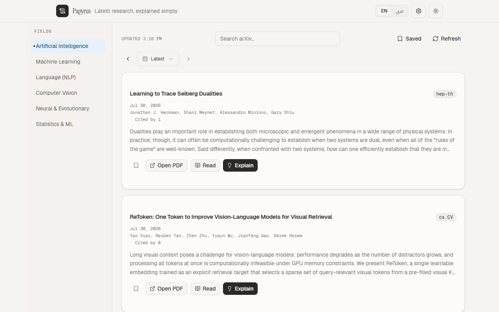
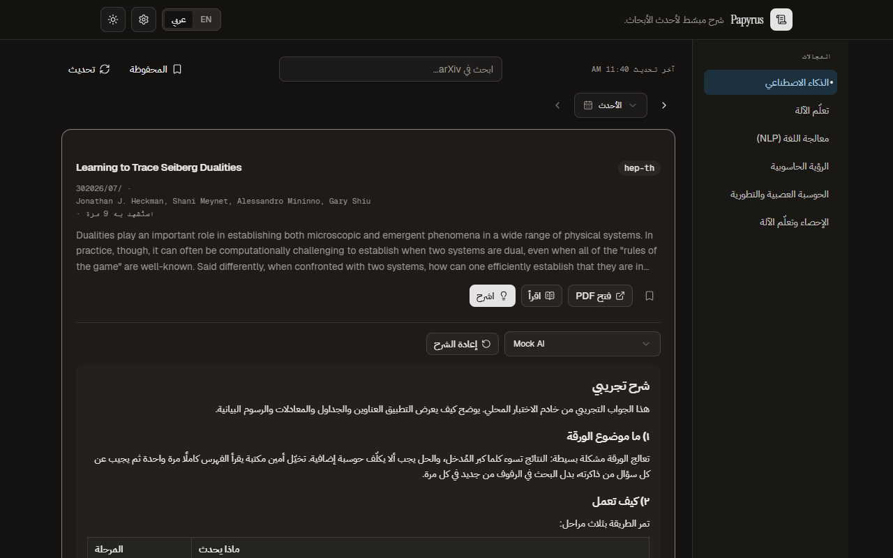
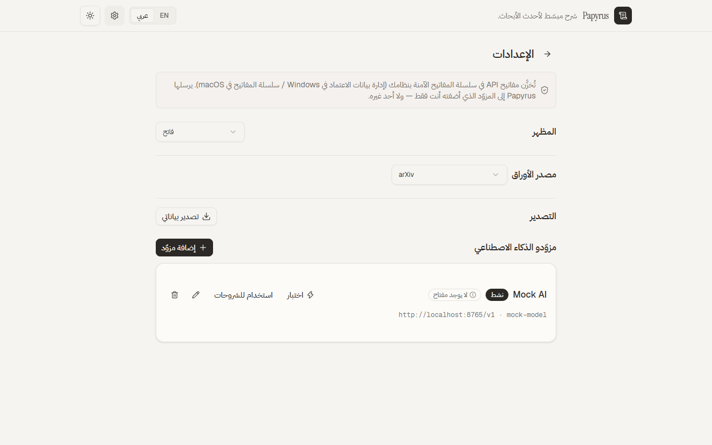
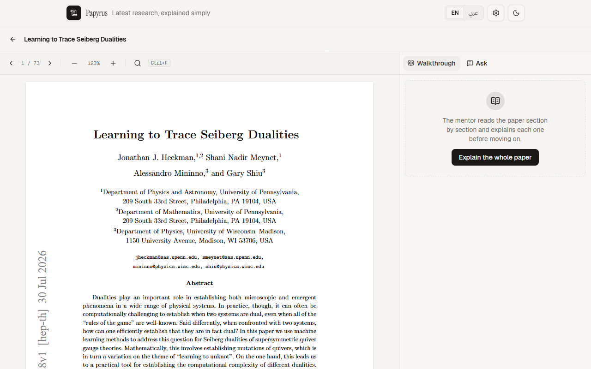

# Papyrus

**The newest research papers, explained in simple language by your own AI.**

Papyrus is a free, open-source desktop app for Windows and macOS. It shows
you the latest research papers from arXiv in the fields you care about, and
it can explain any paper in plain words using the AI provider you already
use (OpenAI, OpenRouter, DeepSeek, Groq, Ollama, or any compatible
service). The app speaks English and Arabic natively, with full
right-to-left (RTL) support.

You bring your own AI key. Papyrus never stores your key in the app or on a
server. It lives in your operating system's keychain, and only the app's
backend can read it.

Built with Tauri 2, React, TypeScript, Tailwind CSS, shadcn/ui, Zustand and
react-i18next. Backend logic is written in Rust.

## Features

| Feature             | What it does                                                                                                                                                  |
| ------------------- | ------------------------------------------------------------------------------------------------------------------------------------------------------------- |
| Latest papers       | Fetches the newest arXiv papers, newest first, for 6 fields (AI, machine learning, language, vision, neural networks, statistics) plus free keyword search    |
| Browse by day       | Step back through any past day (arXiv date-range queries), or pick a day from the collected history list                                                      |
| Daily history       | The app automatically collects each day's papers for the current field (last 14 days on first launch, 30 days kept), so past days are always available        |
| AI explanations     | Explains any paper in 200 to 300 plain words, streamed live, in the language of the interface (English or Arabic)                                             |
| Markdown answers    | AI answers render as real markdown: headings, lists, tables, math equations (KaTeX) and mermaid diagrams, styled to the app and RTL-aware                     |
| In-app PDF reader   | Open any paper's PDF inside the app: page navigation, zoom, find-in-page search with highlights, and text selection. PDFs are cached on disk                  |
| Whole-paper mentor  | The mentor reads the paper section by section and explains each one (press Continue between sections), then gives a final synthesis of the whole paper        |
| Paper chat          | Ask anything about the paper in the Ask tab. Answers are grounded in the paper, and any passage you select in the PDF becomes context for your question       |
| Your providers      | Works with OpenAI, OpenRouter, DeepSeek, Groq, Mistral, Ollama (local) or any custom base URL and model name                                                  |
| Privacy first       | API keys live in the OS keychain (Windows Credential Manager / macOS Keychain). Paper fetching and AI calls happen in the Rust backend, never in the web page |
| Bilingual           | Instant English to Arabic switching, full RTL layout, Cairo font                                                                                              |
| Light and dark mode | Theme toggle, remembered between sessions                                                                                                                     |
| Favorites           | Bookmark papers and filter the list to show only saved ones                                                                                                   |

## Screenshots

| Papers (English)                                | Explanation (Arabic, dark)                           |
| ----------------------------------------------- | ---------------------------------------------------- |
|  |  |

| Settings (Arabic)                                   | Reader (English)                                |
| --------------------------------------------------- | ----------------------------------------------- |
|  |  |

## How it works

Papyrus has two parts that talk to each other:

1. **The frontend** (React). This is the window you see: the paper list,
   the settings page, the language and theme toggles. It only draws the
   interface. It never touches your API key.
2. **The backend** (Rust). This is the engine. It talks to arXiv, it talks
   to your AI provider, and it reads and writes your key in the OS
   keychain.

```
[ The window you see (React) ]
            |
            | commands through Tauri (invoke)
            v
[ The engine (Rust backend) ]
      |           |                |
      |           |                +--> OS keychain (your API keys)
      |           +-------------------> your AI provider (OpenAI-compatible API)
      +-------------------------------> arXiv API (paper feed)
```

**The paper flow.** When you pick a field (for example cs.AI), the frontend
asks the Rust backend for the newest papers. The backend calls the arXiv
API, parses the XML answer, and returns a list of papers with title,
authors, date, abstract, categories and a PDF link. arXiv sends no
permission headers for browser calls, so this always happens in the
backend, never directly from the web page.

**The explanation flow.** When you click Explain on a paper, the backend
reads your key from the OS keychain, builds a short request containing the
paper title and abstract, and sends it to your provider. The provider
answers with a stream of text. Each piece of text arrives through a secure
channel to the frontend, which shows it as it is generated. If you press
Stop, the backend cancels the request with a typed signal that the
interface understands. Nothing about your key ever passes through the
frontend.

**The key flow.** In Settings you add a provider: a name, a base URL, a
model name, and your API key. The key is written straight from the
interface to the backend, which stores it in the OS keychain. The frontend
only ever knows whether a key exists, never its value.

## How to use it

1. **Install the app.** Use the Windows installer (MSI or setup EXE) or
   the macOS app bundle from the release page.
2. **Add an AI provider.** Open Settings, press "Add provider", choose a
   preset (OpenAI, OpenRouter, DeepSeek, Groq, Ollama) or type a custom
   base URL and model. Paste your API key. Press "Test" to check the
   connection. Ollama on your own machine works without a key.
3. **Browse papers.** Pick a field from the sidebar. The 20 newest papers
   appear, newest first. Use the search box to look for any topic. Press
   the refresh button to check for new uploads.
4. **Read a paper.** Press "Read" to open the paper's PDF inside the app:
   flip pages, zoom, and search inside the PDF. The PDF button next to it
   still opens the paper on arXiv in your browser. The bookmark button
   saves it to your favorites, and the "Saved" toggle shows only saved
   papers.
5. **Explain a paper.** Press "Explain". The explanation streams in,
   written in the current interface language, using the research-mentor
   style (every technical term explained, no AI-sounding text). Use
   "Stop" to cancel or "Regenerate" to ask again. You can switch
   providers from inside the explanation panel.
6. **Walk through a whole paper.** Inside the reader, press "Explain the
   whole paper". The mentor explains the paper section by section; press
   "Continue" when you are ready for the next section, and it finishes
   with a final summary of the whole paper.
7. **Ask questions about a paper.** Open the "Ask" tab inside the reader
   and type any question. The answer is grounded in the paper's text.
   Select a passage in the PDF first and the question is answered with
   that passage as context. Your chat history is kept per paper.
8. **Switch language and theme.** Use the toggles in the top bar. The
   whole interface flips to Arabic with full RTL, and explanations are
   then written in Arabic. Your choice is remembered.

## How many papers do you get?

Today's view is the latest 20 papers for the field you are looking at,
newest first. You can refresh as often as you like. arXiv has no daily
quota; it only asks for politeness (about one request every 3 seconds),
and the app enforces that for you automatically.

There is also a history feature. Every time you open a field, the app
quietly collects that field's papers day by day: on the first launch it
backfills the last 14 days (up to 50 papers per day), and it keeps 30
days of history per field. The day picker next to the paper list shows
every collected day with its paper count ("Jul 30 (23)"). Click a day to
browse it, or use the arrows to step through any past day, even ones
older than the collected history (those are fetched live from arXiv).

So there is no fixed "papers per day" number. You get up to 20 papers
per view in the latest view, up to 50 per day in the history, and you
can browse any past day at any time.

## How explanations work

When you press Explain, the backend reads your key from the OS keychain,
sends the paper's title and abstract to your provider with a system prompt
that turns the model into a **research mentor**, not a summarizer. The
mentor is asked to:

1. Explain what the paper is about and how it works in plain terms
2. Explain every technical term the first time it appears
3. Use analogies and simple, natural language (no AI-sounding cliches)
4. Point out the paper's assumptions and weaknesses
5. Never invent details that are not in the paper

The answer is 200 to 300 words, in short paragraphs, in the language of
the interface (English or Arabic), and it renders as real markdown:
headings, lists, tables, math equations and even diagrams. The text
appears progressively as the provider generates it. You can stop or
regenerate at any time.

**Whole-paper walkthroughs** work the same way, but the mentor receives
the actual text of the paper, section by section. The reader extracts the
text from the PDF, splits it into sections, and the mentor explains each
section using a full teaching structure before you press Continue. At the
end it produces a final synthesis: the five most important ideas, the
three biggest limitations, how the paper differs from earlier work, what
to learn next, and five questions to check understanding.

**The Ask tab** is a grounded chat: your question (plus any passage you
selected in the PDF) is sent together with the relevant section of the
paper, and the mentor answers only from that context, honestly saying
when the answer is not in the paper.

The explanation uses your provider and your model, so the cost (if any) is
exactly what your provider charges for the tokens used, typically a small
fraction of a cent for a 300-word answer. With a local Ollama model it is
free.

## How it was built

Papyrus was built in phases, each verified before moving on:

1. **Foundation.** A Tauri 2 project with React, TypeScript, Tailwind CSS
   and shadcn/ui, with English and Arabic and RTL working from the first
   day.
2. **Papers.** A Rust command that fetches and parses the arXiv feed, with
   rate limiting, plus the paper list UI with loading, empty and error
   states.
3. **AI explanations.** A streaming explain command, secure key storage in
   the OS keychain, a settings page for managing providers, and a mock AI
   server so the whole flow can be tested without spending tokens.
4. **Polish.** Custom icon, installers for Windows, README, MIT license.
5. **Audit and hardening.** A deep review produced 28 improvement plans:
   bug fixes (including a stream decoder fix for Arabic text, a race
   condition when switching fields quickly, and stop-button correctness),
   security hardening (HTTPS enforcement, key redaction in error
   messages, trimmed permissions, a maintained keyring library), testing
   infrastructure, linting and formatting, pre-commit hooks, a CI pipeline
   for Windows and macOS, keyword search, favorites, and two design specs
   for future features. Every plan landed as its own commit with tests.
   The git history reads as a story of the project.
6. **The reader.** An in-app PDF reader (pdf.js), a whole-paper mentor
   walkthrough that explains the paper section by section, and a grounded
   chat where selections in the PDF become answer context.

## What changed since the first version

This log is updated with every change, fix, or upgrade. If you notice it
is out of date, update it (see AGENTS.md, "Keep the changelog current").

### Version 0.1.0 (the first version)

The original release contained: latest papers from arXiv in 6 fields,
AI explanations with streaming in English and Arabic, provider management
with keys in the OS keychain, light and dark mode, a custom icon,
installers for Windows, and the MIT license.

### Problems found and how they were solved

| Problem                                                                                                                               | How it was solved                                                                                                                                                                                                                                                                                                                                                            |
| ------------------------------------------------------------------------------------------------------------------------------------- | ---------------------------------------------------------------------------------------------------------------------------------------------------------------------------------------------------------------------------------------------------------------------------------------------------------------------------------------------------------------------------- |
| Arabic explanations arrived garbled: multi-byte characters split across network chunks were decoded wrongly by the Rust stream parser | The parser now buffers raw bytes and decodes only complete lines, so split characters survive. A regression test splits a response in the middle of an Arabic letter.                                                                                                                                                                                                        |
| Switching fields quickly could show the wrong list: a slow response for an old field overwrote the new one                            | The papers store now drops stale responses with a sequence token; only the newest request can update the list.                                                                                                                                                                                                                                                               |
| The Stop button could mislabel provider errors as stops, and cancelling had a race window                                             | A typed cancellation marker (a machine-readable constant) replaces word matching, and per-paper generation counters make late chunks harmless.                                                                                                                                                                                                                               |
| Deleting a provider could silently orphan its API key in the keychain                                                                 | The settings UI now surfaces keychain delete failures and keeps the provider row until the key is actually removed.                                                                                                                                                                                                                                                          |
| English paper text was right-aligned and misordered inside the Arabic layout                                                          | Paper titles, authors, abstracts and category codes are wrapped in `dir="ltr"`, and the title/meta rows are anchored left-to-right, so English content reads from the left inside the RTL interface.                                                                                                                                                                         |
| The day picker only showed days that had papers, and the arrows could stick under rapid clicking or while loading                     | The picker now lists the full 14-day history, the arrows read the live store state (one day per click, no collapse), they no longer freeze during fetches, and collected days render instantly from the history cache.                                                                                                                                                       |
| Key-shaped strings could appear in provider error messages                                                                            | Error bodies are redacted before they reach the interface, in both the Rust and browser paths.                                                                                                                                                                                                                                                                               |
| A provider URL over plain HTTP would send the API key in clear text                                                                   | Remote URLs must now be HTTPS; plain HTTP is only accepted for loopback servers such as Ollama.                                                                                                                                                                                                                                                                              |
| PDF links from arXiv could come back as plain HTTP                                                                                    | All arXiv PDF links are normalized to HTTPS at parse time.                                                                                                                                                                                                                                                                                                                   |
| The Stop button did nothing in the browser development preview                                                                        | The browser stream is now aborted with an AbortController that surfaces the same typed cancellation marker.                                                                                                                                                                                                                                                                  |
| Corrupted or hand-edited localStorage could crash the settings page                                                                   | Provider data is validated on load: malformed entries are dropped and dangling active-provider ids are repaired.                                                                                                                                                                                                                                                             |
| The keychain plugin was an unmaintained community plugin                                                                              | It was replaced with the maintained `keyring` crate, used directly against Windows Credential Manager and macOS Keychain.                                                                                                                                                                                                                                                    |
| The webview had a full keychain permission it never used                                                                              | The capability was removed (least privilege), leaving only `core:default` and `opener:allow-open-url`.                                                                                                                                                                                                                                                                       |
| The app started with no frontend tests and no quality gates                                                                           | Vitest was added (87 frontend tests today), the Rust suite grew to 39 tests, and ESLint, Prettier, strict typecheck, clippy and rustfmt run on every commit through pre-commit hooks.                                                                                                                                                                                        |
| The repo had no automated builds                                                                                                      | A GitHub Actions workflow now runs the full gate suite and builds installers on Windows and macOS.                                                                                                                                                                                                                                                                           |
| The mock AI server refused browser requests (CORS)                                                                                    | CORS headers and preflight handling were added, so the dev preview can stream test explanations.                                                                                                                                                                                                                                                                             |
| The interface looked like a default template: pure neutral grays, no accent, flat interactions                                        | Redesign pass (taste-skill): warm paper-toned palette with a single ink-blue accent, pressed-button feedback, refined card typography (tracking, balanced titles, tabular numerals), active-category indicator, and a skip-to-content link.                                                                                                                                  |
| Raw arXiv category codes (cs.AI, cs.LG) next to each field name confused users                                                        | Removed the codes from the sidebar; the arXiv code is now a hover tooltip.                                                                                                                                                                                                                                                                                                   |
| Explanations read like generic AI text and did not teach the reader                                                                   | The system prompts now follow a research-mentor methodology (user mandate): every technical term explained, analogies, no invented details, researcher-style thinking, and explicit anti-cliche style rules for natural language in both English and Arabic. The full-paper section-by-section mentor structure is saved in the prompt file, ready for the whole-PDF reader. |
| AI answers came back as raw plain text; markdown, tables, equations and diagrams were unreadable                                      | The app now renders AI markdown: GFM tables, KaTeX equations and mermaid diagrams (lazy-loaded only when a diagram appears, strict security level, follows light/dark theme, LTR inside RTL). The table ban in the prompts was lifted. The mock AI server now replies with rich markdown to demonstrate the renderer.                                                        |
| PDFs could only be opened in the external browser                                                                                     | In-app reader: an embedded pdf.js viewer renders the paper inside the app with page navigation, zoom, find-in-page search with highlights, and text selection. PDFs are fetched and cached on disk by the Rust backend (keyed by arXiv id).                                                                                                                                  |
| The AI could only explain from the title and abstract                                                                                 | Whole-paper mentor walkthrough: the reader extracts the PDF text, splits it into sections, and explains each section step by step using the full mentor structure (you press Continue between sections), then produces the final synthesis.                                                                                                                                  |
| There was no way to ask questions about a paper                                                                                       | Grounded chat: ask anything about the paper in the Ask tab; the answer is grounded in the relevant section, and any passage you select in the PDF becomes context for the question. Chat history is kept per paper.                                                                                                                                                          |
| The Rust test suite had a flaky streaming test: it failed roughly half the runs under machine load                                    | Root cause: the cancellation flag was a single global shared by every concurrently running test, so the cancel test could abort another test's stream mid-flight. The flag is now injected per stream call; the cancel test uses its own local flag. Seven consecutive full-suite runs are green.                                                                            |
| The whole-paper walkthrough and the paper chat stopped after the first few words of every answer                                      | Root cause: the chunk-flush guard only applied the buffer while the entry was still "loading", so the first flush (which flips it to "streaming") froze the text forever. Flushes now apply to loading and streaming entries alike, and regression tests stream slowly to force several flush cycles.                                                                        |
| There was no way back to the papers list from the Settings page                                                                       | The Settings page now has a back button in its header (correct arrow direction in both languages).                                                                                                                                                                                                                                                                           |
| Arrows pointed the wrong way and icons sat on the wrong side in Arabic                                                                | The reader back button and the settings back button now use ArrowLeft with an RTL rotation (left-pointing in English, right-pointing in Arabic), and the day-picker select uses logical padding and positioning so its checkmark stays on the reading-side edge.                                                                                                             |
| The question box in the reader scrolled out of view with long chats                                                                   | The Ask tab now pins the input in its own row at the bottom of the panel; only the chat history scrolls above it, so the input is always visible.                                                                                                                                                                                                                            |
| Explanations still read like generic AI text                                                                                          | All eight prompts now carry strict writing-quality rules: short sentences, one idea per sentence, plain words, concrete examples, no filler openings ("In this paper", "Furthermore"), no repeated paragraph openings, and a read-out-loud self-check. The mock AI server's demo answers were rewritten to model the mentor voice in both languages.                         |

### New features added after the first version

- **Keyword search** across arXiv (title, abstract, authors), debounced
  while you type.
- **Favorites**: bookmark any paper and filter the list to show only
  saved ones.
- **Browse by day**: step through any past day with the arrows, or pick
  a day from the collected history.
- **Auto-collected daily history**: the app gathers each field's papers
  day by day (14 days backfilled on first launch, 30 days kept) and shows
  them with paper counts.
- **Day views are instant**: collected days render from the history cache
  while the live refresh happens in the background.
- **Pre-commit hooks and CI** (Windows + macOS) with lint, formatting,
  typecheck, clippy and rustfmt.
- **Reusable screenshot capture** script for keeping the README images
  current.
- **Markdown rendering** for AI answers: headings, lists, GFM tables,
  KaTeX equations and lazy-loaded mermaid diagrams, styled to the design
  system and RTL-aware.
- **In-app PDF reader**: embedded viewer with page navigation, zoom,
  find-in-page search and text selection; PDFs are cached on disk.
- **Whole-paper mentor walkthrough**: every section explained step by
  step with the full mentor structure, then a final synthesis.
- **Grounded paper chat**: ask questions about the paper; selected
  passages become answer context; per-paper chat history.
- **Design specs** for two future features: provider failover and a
  second paper source (Semantic Scholar / OpenAlex).

## Technical choices and why

| Choice                                        | Why                                                                                                                                                                                                                                                                                                                                                 |
| --------------------------------------------- | --------------------------------------------------------------------------------------------------------------------------------------------------------------------------------------------------------------------------------------------------------------------------------------------------------------------------------------------------- |
| Tauri 2 instead of Electron                   | Installers are a few megabytes instead of a hundred or more, because Tauri uses the operating system's own web engine. The backend is Rust, which is fast and safe.                                                                                                                                                                                 |
| React + TypeScript (strict)                   | The standard modern UI stack. Strict TypeScript catches a whole class of bugs at compile time.                                                                                                                                                                                                                                                      |
| Tailwind CSS v4 + shadcn/ui                   | Fast, consistent, accessible UI. Components are local source files, so they are easy to customize and have no design-system lock-in.                                                                                                                                                                                                                |
| Zustand for state                             | A tiny store library with no boilerplate. The app's state (papers, settings, explanations) stays simple to follow.                                                                                                                                                                                                                                  |
| react-i18next                                 | The mature internationalization library. Instant language switching and correct RTL document direction.                                                                                                                                                                                                                                             |
| Pure Rust backend instead of a Python sidecar | One toolchain, one package. Bundling Python into a desktop installer on Windows is painful. Everything needed (HTTP, XML parsing, streaming) is simple and robust in Rust.                                                                                                                                                                          |
| arXiv as the first paper source               | Free, no API key, and it is where new research appears first. Semantic Scholar and OpenAlex are designed in as future sources.                                                                                                                                                                                                                      |
| OpenAI-compatible protocol for AI             | One abstraction (base URL + key + model) covers OpenAI, OpenRouter, DeepSeek, Groq, Mistral, local Ollama and any custom endpoint. No provider-specific code.                                                                                                                                                                                       |
| reqwest with native TLS                       | Uses the operating system's certificate store (Windows schannel). Avoids extra build tools on Windows and keeps the installer lean.                                                                                                                                                                                                                 |
| The keyring crate for keys                    | The standard Rust library for OS credential vaults: Windows Credential Manager and macOS Keychain. Keys never touch app storage or the web view.                                                                                                                                                                                                    |
| Streaming with SSE over a Tauri channel       | Explanations appear as they are generated, which feels fast, and cancellation is clean and typed.                                                                                                                                                                                                                                                   |
| Mock AI server for development                | A small OpenAI-compatible server (dev/mock-ai-server.mjs) lets you exercise the full explain flow, in both languages, without spending tokens.                                                                                                                                                                                                      |
| pdf.js for the in-app reader                  | Mozilla's PDF renderer, embedded in the app. One engine does the viewer (canvas + selectable text layer), find-in-page search, and the text extraction that powers the mentor walkthrough and the chat.                                                                                                                                             |
| Testing and quality gates                     | 39 Rust tests and 89 frontend tests cover parsing, streaming, error paths, stores, the markdown renderer, PDF text logic and the reader state machine (including multi-flush streaming regressions). ESLint, Prettier, strict typecheck, clippy and rustfmt run on every commit through pre-commit hooks, and CI repeats them on Windows and macOS. |

## Project layout

```
src/                React frontend
  components/         shared UI components (shadcn/ui)
  components/markdown  markdown renderer (tables, KaTeX, mermaid)
  components/pdf-viewer embedded pdf.js reader
  features/           papers (list, card, explain) and reader (viewer + AI panel)
  hooks/              theme hook
  i18n/               English and Arabic strings
  lib/                types, arXiv client, AI client, PDF bytes, text splitting
  stores/             Zustand stores (papers, settings, explanation, reader, ui, favorites)
src-tauri/          Rust backend
  src/                papers.rs (arXiv), ai.rs (AI streaming + keychain), pdf.rs (PDF fetch + cache)
  capabilities/       webview permissions (least privilege)
dev/                Development-only tools (mock AI server, screenshot capture, sample PDF)
docs/               Screenshots and design specs
plans/              The 28 improvement plans that shaped the final version
```

## Development

Prerequisites: [Rust](https://rustup.rs), Node.js 20 or newer (which ships
[corepack](https://nodejs.org/api/corepack.html); run `corepack enable
pnpm` to get pnpm), [pnpm](https://pnpm.io/installation) 9 or newer, and on
Windows: Visual Studio Build Tools (C++) and WebView2.

```bash
pnpm install
pnpm tauri dev
```

### Local mock AI server (no API key needed)

To develop and test the explain flow without spending tokens:

```bash
pnpm mock-ai
# then add it in Papyrus Settings:
#   Base URL: http://localhost:8765/v1
#   Model:    mock-model
#   API key:  anything (or empty)
```

### Regenerating the screenshots

With the dev server and mock AI server running (see above):

```bash
pnpm exec node dev/capture-screenshots.mjs
```

## Tests, lint and formatting

```bash
cargo test --manifest-path src-tauri/Cargo.toml   # Rust: parsing, streaming, error paths
pnpm test                                          # Frontend unit tests (Vitest)
pnpm run build                                     # TypeScript strict check + production build
pnpm lint                                          # ESLint
pnpm typecheck                                     # TypeScript strict (tsc --noEmit)
pnpm format                                        # Prettier, write formatting fixes
pnpm format:check                                  # Prettier, verify formatting
```

Pre-commit hooks (via [lefthook](https://lefthook.dev)) run typecheck,
lint, formatting checks and `cargo fmt --check` automatically on every
commit. CI (GitHub Actions) runs the same gates plus the Rust test suite
and desktop builds on Windows and macOS.

A live arXiv fetch test is included but ignored by default (it needs a
network connection):

```bash
cargo test --manifest-path src-tauri/Cargo.toml live_fetch_from_arxiv -- --ignored
```

## Security notes

- API keys are written to and read from the OS keychain by the Rust
  backend only. They never enter the web view.
- The webview runs with a restricted capability set (`core:default` and
  `opener:allow-open-url`). The keychain plugin permission is not exposed
  to the web view at all.
- The webview ships without a Content-Security-Policy (`"csp": null` in
  `src-tauri/tauri.conf.json`) by design. The UI loads only local bundled
  assets, and users configure arbitrary provider base URLs, which a
  static `connect-src` whitelist cannot express.
- AI responses are rendered as markdown, not raw HTML: the renderer
  escapes any HTML tags the model produces (no raw-HTML passthrough),
  mermaid diagrams run in strict security mode, and links open through
  the operating system's browser. PDF text is only ever shown inside
  the pdf.js viewer and sent to the AI backend; it is never injected
  into the page as HTML.
- Remote provider URLs must use HTTPS. Plain HTTP is only accepted for
  local servers such as Ollama, so keys are never sent in clear text.
- Provider error messages are redacted: key-shaped strings are masked
  before they reach the interface.
- arXiv's rate limit (about one request per 3 seconds) is enforced in the
  Rust fetcher.
- Paper content and AI responses are handled as untrusted data: markdown
  rendering escapes HTML, and PDF downloads are capped in size and
  rendered sandboxed in the viewer.

## Roadmap

- Provider failover: if the active provider fails, try the next one
  automatically (design spec ready in docs/spikes).
- Second paper source: Semantic Scholar or OpenAlex for citation counts
  and richer metadata (design spec ready in docs/spikes).
- Daily digest: pick the most interesting papers of the day (history is
  already collected; the digest would select and surface them).
- macOS signing and notarization for a smoother install experience.

## License

[MIT](LICENSE)
